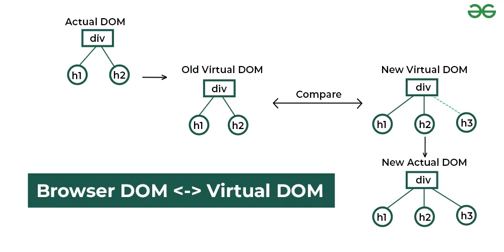

#### How does React work?

React operates by creating an in-memory virtual DOM rather than directly manipulating the browser’s DOM. It performs necessary manipulations within this virtual representation before applying changes to the actual browser DOM. React is efficient, altering only what requires modification.


___

#### State Vs. Props

State : The state is an updatable structure that is used to contain data or information about the component and can change over time. The change in state can happen as a response to user action or system event. 

Props : Props are read-only components. It is an object which stores the value of attributes of a tag and work similar to the HTML attributes. It allows passing data from one component to other components.


| SN              | Props | state |
| :---------------- | :------: | ----: |
| 1 | Props are read-only. | State changes can be asynchronous. |
| 2 | Props are immutable. | State is mutable. |
| 3 | Props allow you to pass data from one component to other components as an argument. | State holds information about the components.|
| 4 | Props can be accessed by the child component. | State cannot be accessed by child components. |
| 5 | Props are used to communicate between components. |States can be used for rendering dynamic changes with the component. |
| 6  |  Stateless component can have Props. | Stateless components cannot have State. |
| 7 | Props make components reusable. |State cannot make components reusable. |
| 8 | Props are external and controlled by whatever renders the component. | The State is internal and controlled by the React Component itself. |

___

#### useContext vs Redux

useContext : useContext is a hook that provides a way to pass data through the component tree without manually passing props down through each nested component. It is designed to share data that can be considered global data for a tree of React components, such as the current authenticated user or theme(e.g. color, paddings, margins, font-sizes).

Redux : Redux is a state managing library used in JavaScript apps. It is very popular for React and React-Native. It simply manages the state and data of your application.


| ****useContext**** | ****Redux**** |
| --- | --- |
| useContext is a hook. | Redux is a state management library. |
| It is used to share data. | It is used to manage data and state. |
| Changes are made with the Context value. | Changes are made with pure functions i.e. reducers. |
| We can change the state in it. | The state is read-only. We cannot change them directly. |
| It re-renders all components whenever there is any update in the provider’s value prop. | It only re-render the updated components. |
| It is better to use with small applications. | It is perfect for larger applications. |
| It is easy to understand and requires less code. | It is quite complex to understand. |
___

#### Communication between components and how many ways?

React provides several methods for handling the component communication, each with its appropriate use cases.
- Parent / Child communication
    - Parent to child communication
    - Child to parent communication
- Context API
- Centralized state with Redux
- Event bus


Parent to child communication:

In React, parent components can communicate to child components using a special property defined by React called Props. Props are read-only and they’re passed from parent to child component via HTML attributes.

```
export function ParentComponent(props) {
  return (
    <div className='App thickborder'>
       <p> I am parent </p>
      <ChildComponent title="This comes from parent"/>
    </div>
  );
}


```
___

Child to parent communication:

Data from a child component to parent component can be passed using a callback. We can achieve this by following the below steps.

Create a callback method in the parent component and pass it to the child using props.
Child component can call this method using “this.props.[callbackFunctionName]” from the child and pass data as an argument.

```

function ChildComponent(props) {
  return (
    <div>
      <input
        type="text"
        onChange={(e) => props.onChangesInChild(e.target.value)}
      />
    </div>
  );
}

export default function ParentComponent(props) {
  const [childValue, setChildValue] = useState("");
  // Define the callback the parent passes to the child.
  const handleChangesInChild = (value) => setChildValue(value);
  return (
    <div>
      <ChildComponent
        title="This comes from parent"
        onChangesInChild={handleChangesInChild}
      />
    </div>
  );
}

```

#### The Pros and Cons of Using Redux with React

**Pros**
1. Centralized State Management : 

    It provides a centralized store for managing application state. This means that all of your components can access the same state, making it easier to keep your application in sync.


2. Predictable Data Flow : 
    
    Redux has a strict unidirectional data flow, which makes it easier to understand how data moves through your application. With Redux, you can ensure that data is always updated in a predictable way, which can help prevent bugs and improve the overall stability of your application.

3. Easy Integration with React

    Redux was specifically designed to work well with React, and it has a small and simple API that is easy to learn and use. You can use the React-Redux library to connect your components to the Redux store and update the state when needed. This makes it easy to build scalable and maintainable React applications.

4. Large Community Support
    
    Redux has a large and active community, with many resources available for learning and troubleshooting. You can find a variety of tutorials, blogs, and other resources online to help you get started with Redux. 

**Cons**

1. Complexity
    
    Redux has a learning curve, and it can take some time to understand the concepts and best practices. Additionally, you may need to write more code to implement Redux in your application, which can increase the overall complexity.

2. Boilerplate Code

    Redux requires you to write a lot of boilerplate code to set up the store, actions, and reducers. This can be time-consuming and tedious, especially if you are just getting started with Redux. However, there are tools and libraries available that can help simplify this process, such as Redux Toolkit.

3. Performance Overhead

    Redux can add some performance overhead to your application, especially if you are working with large amounts of data. Because Redux requires you to copy the state every time it is updated, this can lead to slower performance in some cases. However, there are ways to optimize your Redux store to minimize this overhead.

4. Overkill for Simple Applications

    Finally, Redux may be overkill for simple applications that don't have complex data flows. If you only need to manage a small amount of state, you may be better off using React's built-in state management instead of adding the complexity of Redux.


####  How to handle session timeout in frontend
Logging users out automatically after a given amount of inactivity reduces security risks and prevents unauthorized access if they leave their session unattended. This feature ensures user privacy and data protection,

Advantages:
- Session timeout increases security by automatically logging users out after a preset inactivity. Other benefits:

- Security Enhancement: Ends idle sessions to prevent data leaks and unwanted access.

- Improved User Experience: Notifies users of session expiration so they can act or re-authenticate without interruptions.

- Complies with user privacy and data protection laws.

- Customization: Allows application-specific timeout durations.

- Releases idle sessions to conserve server resources and improve system efficiency.

Additional Resources:

[App timeout in React: A Comprehensive Guide](https://blog.openreplay.com/app-timeout-in-react/)

[Session TimeOut in React](https://michell-e.medium.com/session-timeout-in-react-2bcf87b12b2)
___


#### Difference between TypeScript and ES6

**TypeScript:**
    
TypeScript is an open-source pure object-oriented programing language. It is a strongly typed superset of JavaScript which compiles to plain JavaScript.

**ES6**

ECMAScript (ES) is a scripting language specification standardized by ECMA international. It was created to standardize JavaScript. The ES scripting language contains many implementations, and the most popular is JavaScript. The developers use ECMAScript mostly for client-side scripting of World Wide Web (WWW).