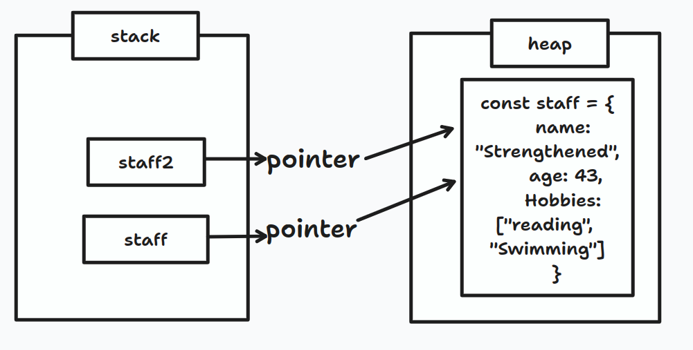

### What is Mutability in JavaScript?

If a data type is mutable, that means that you can change it. Mutability allows you to modify existing values without creating new ones.



Here, changing the age of staff2 updates the age of the staff object. Now you know it is because both point to the same object.


### How to Clone Object Properties
You can clone the properties of an object using the Object. assign() method and the spread operator. With these, you can change the properties of the cloned object without changing the properties of the object from which it was cloned.

1. `Object.assign()`

The object.assign method copies properties from an object (the source) into another object (the target) and returns the modified target object.

Here's the syntax:

```
Object.assign(target, source)
```
Example:
```
 const staff = {
      name: "Strengthened",
      age: 43,
      Hobbies: ["reading", "Swimming"]
   }

   const staff2 = Object.assign({}, staff);
```

2. `Spread Operators`

Syntax:
```
const newObj = {...obj}
```

Example:
```
 const staff = {
    name: "Strengthened",
    age: 43,
    Hobbies: ["reading", "Swimming"]
   }

   const staff2 = {...staff};


   staff2.age = 53;

   console.log(staff)

   console.log(staff2)

```

### What is Immutability in JavaScript?
Immutability is the state where values are immutable (that is, not able to be changed). A value is immutable when altering it is impossible. Primitive data types are immutable, 

### How to Prevent Object Mutability?
To prevent object mutability, you can use the Object.preventExtensions(), Object.seal(), and Object.freeze() methods.


1. Object.preventExtensions(obj)

    Using Object.preventExtensions stops new properties from entering the object. The object does not increase in size and maintains its properties. By default, all objects in JavaScript are extensible. With this method, you can delete properties from your object

    Example:
    
    ```
    const makeNonExtensive = {
            firstname: "Charles",
            lastname: "Chandlier"
    }

    Object.preventExtensions(makeNonExtensive)

    makeNonExtensive.designation = "Software Engineer";

    console.log(makeNonExtensive)
   
    ```

2. Object.seal()

    All objects in Javascript are extensible by default. Just as the name suggests, this method seals an object. You cannot add new properties to a sealed object or delete an existing property from a sealed object. But object.seal permits modifying existing properties.

    Example:
    ```
        const studentNames = {
            student1: 'Halina',
            student2: "Brookes", 
            student3:"Alina"
        }

        Object.seal(studentNames)

        console.log(Object.isSealed(studentNames))

        // we are allowed to change existing property
        studentNames.student2="srinvas"
        console.log(studentNames)


    ```

3. How to Use Object.freeze()

    The Object.freeze() method freezes an object. Using this method guarantees high integrity by ensuring that pulling out, modifying existing properties, or adding new properties to the object will not be possible.

    ```
    const teamplayers = {
           player1: "Andrey",
           player2: "Abundance"
   }


   Object.freeze(teamplayers)

   teamplayers.player3 = "Finder";

   console.log(teamplayers)

    ```
    Modifying object with Dot notation fails silently when trying to add a property, but defineproperty throws a TypeError instead.

    ### Deep Freeze

    Freeze method does not prevent nested object from mutability. In Order to prevent children from Mutablility we have to apply freeze to nested children as well as follows

    ```
const deepVal = obj => {
        Object.keys(obj).forEach(prop => {
        if (typeof obj[prop] === 'object') deepVal(obj[prop]);
        });
        return Object.freeze(obj);
 };

    const teamplayers = deepVal( {
            player1: "Andrey",
            player2: "Abundance",
                    substitutes: {
                        player3: "Jeremiah",
                        player4: "Jayden"
                    }
            }
    )

   Object.freeze(teamplayers)

   Object.defineProperty(teamplayers.substitutes, 'player5', {
      value: "Alice"
   })

   console.log(teamplayers)
   
    ```